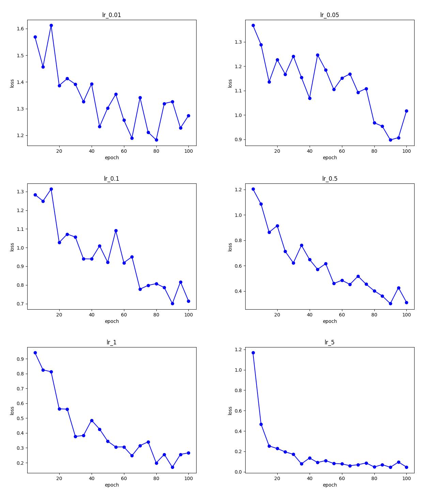
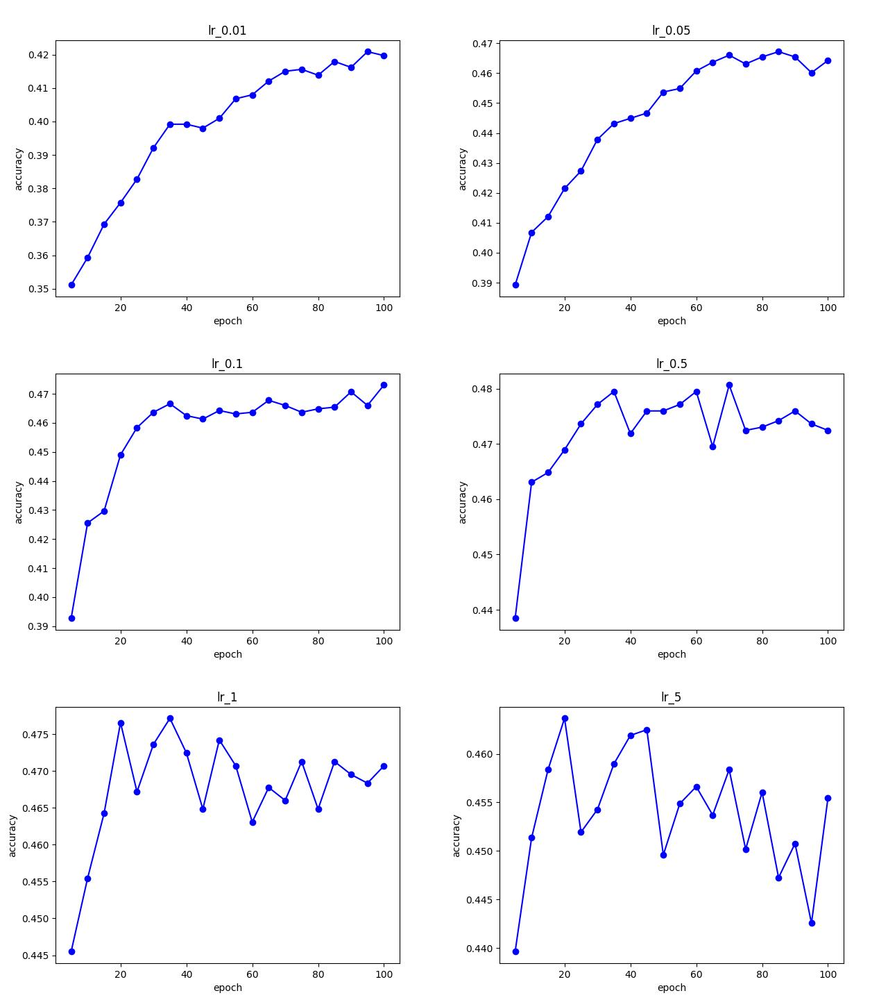
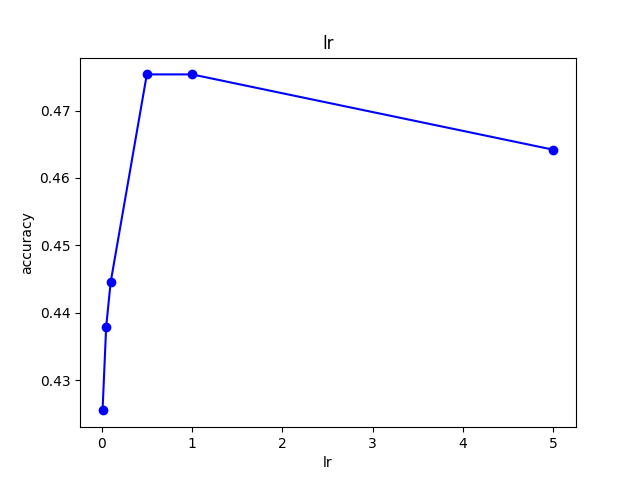
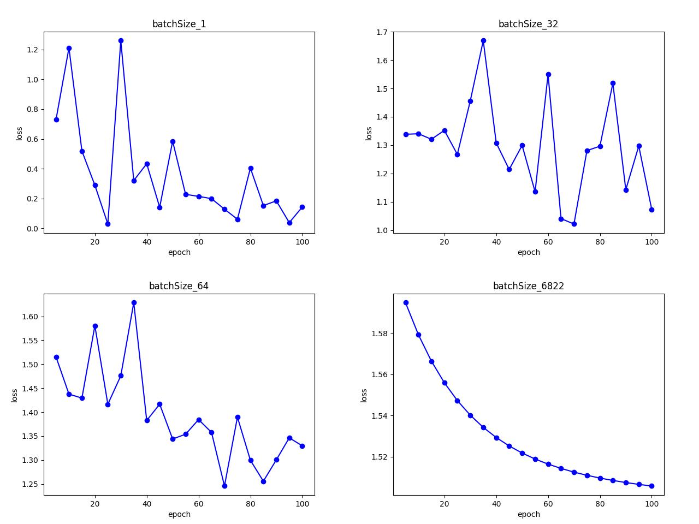
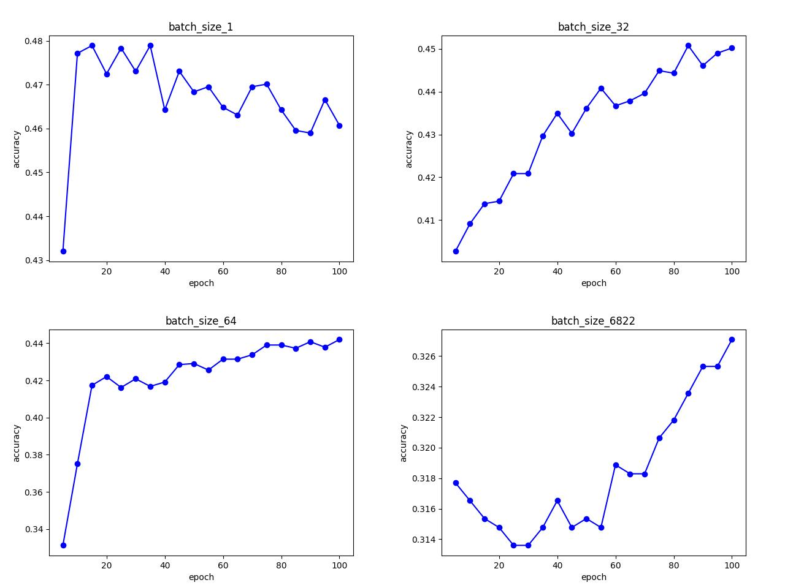
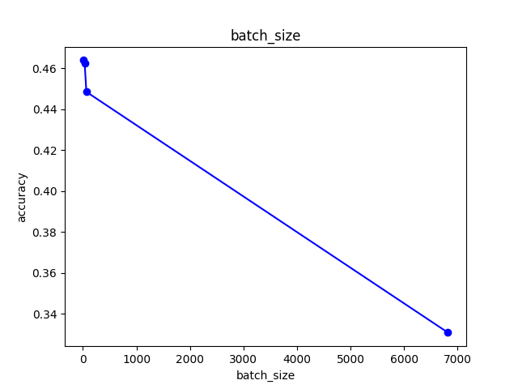
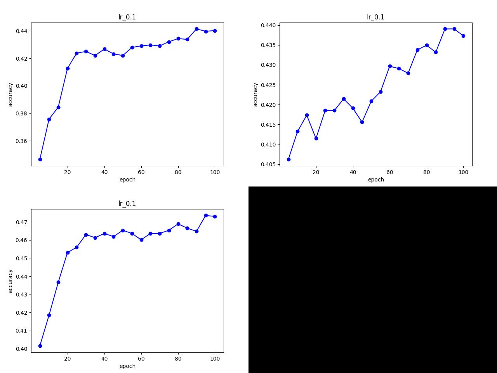

# 任务背景
本任务需要基于机器学习，实现简单的文本分类任务。任务需要基于numpy和pytorch的相关函数，手动构建神经网络、损失函数，并结合词袋模型、N-gram等方式进行词向量化。在完成任务过程中，使用pytorch的相关函数可以在一个batch上进行操作，从而加快训练过程。任务完成后，训练的模型能够实现简单的文本分类任务。
[本练习的代码仓库](https://github.com/Crnaneo/FudanNLP-Task1)。
该仓库为完成https://github.com/FudanNLP/nlp-beginner相关任务。

# 方法实现
## 读取数据
利用pandas的相关函数读取tsv文档中的文本和标签，分别存在两个python列表中，再利用sklearn的相关函数按照8：2的比例划分训练、验证集。数据集使用任务文档提供的调优后的kaggle数据([训练集](https://fudan-nlp.feishu.cn/wiki/VhCHwZiXQicIYrkbd2ocFS6Kn9c#share-Kx4odvWmqoeI6sxtATmcEnrNnSe)[测试集](https://fudan-nlp.feishu.cn/wiki/VhCHwZiXQicIYrkbd2ocFS6Kn9c#share-B5tSdOad6oPdHUx3hcYcFUjEnnE))
## 词向量化
在实验中，尝试词袋、TF-IDF、N-gram三种方式进行词向量化，在这里直接利用`sklearn.feature_extraction.text`的`TfidfVectorizer`,`CountVectorizer`进行向量化。以此验证不同词向量化方式的差别。在完成向量化后，将生成矩阵转化为torch的Tensor类型，以便后续计算和梯度下降。
## 模型定义
模型使用单线性层，含偏置，并用softmax作激活函数，交叉熵函数作损失函数，未添加优化器及正则化。
## 训练
设置`lr`,`epochs`，调整`batch_size`实现mini-batch、batch等模式，实现模型的前向传播，反向传播，更新参数流程。每5个epoch输出一次当前的损失和在测试集上的准确率。后续亦调整lr验证不同学习率对模型表现的影响
# 验证
在训练完成后，在测试集上测试模型的表现情况，并将实验结果利用matplotlib画图。
定义模型/损失函数->在epoch里前向传播->计算损失->反向传播->更新参数->验证
# 实验设计
## 验证不同学习率对模型表现情况的影响
控制epochs=100, batch_size=64不变，调整lr，测试在同样的模型中，不同学习率对模型表现的影响。在实验过程中，记录模型在训练集的损失、测试集的准确率、最终在测试集上的表现情况，并将结果绘制成图表
# 验证不同批量大小对模型表现情况的影响
控制epochs=100，lr=0.1不变，调整batch_size为1，32，64，`X_train_t.size()[0]`，实现SGD，mini-batch，batch三种训练方式，对比训练时间和模型的表现。
# 验证不同的向量化方式对模型表现情况的影响
在epochs=100, lr=0.1, batch_size=64的情况下，修改词向量化模式为词袋、Tfidf、N-gram三种方式，比较模型的收敛情况和最终测试表现
# 结果分析
## 实验1

图1：训练损失在不同学习率情况下的变化

图2：验证集准确率在不同学习率情况下的变化

图3：最终测试集准确率和学习率的关系

对比上面三张图可得，模型在训练过程中有较明显振荡。在学习率较低（$\leq0.1$时）模型收敛情况较差，在跑完100个epochs之后，损失仍较高且不收敛。随学习率增加，模型收敛所需要的epoch变小。但是当学习率$\ge0.05$时，模型基本在训练后阶段在验证集上表现已在较低处收敛，即使在训练集上的损失仍在下降。证明单线性层时，模型的泛化能力有限，在后续的训练中更多记忆数据的噪声而非进行有效训练。在未进行正则化的情况下，模型容易出现过拟合的情况。
## 实验2

图4：训练损失在不同批量大小情况下的变化

图5：验证集准确率在不同批量大小情况下的变化

图6：最终测试集准确率和批量大小的关系

对比上面三张图可知，当batch_size较小的情况下（SGD模式），梯度下降过程振荡较强，但是相对损失下降较快，能达到更低水平。在测试集的表现，SGD和mini-batch整体相差不大，但使用batch模式训练模型准确率较差。
分析如上结果的原因为当batch_size较小时，梯度容易受样本的特例或者噪声影响，导致在不同的batch中，梯度下降的方向、大小不同，因此出现强烈振荡。但这样也能够更好捕捉到数据中更多特征，且能更多次调整参数找到全局最低点。因此它整体损失下降较快、泛化能力较好。当batch较大（使用batch模式时），模型不受随机噪声影响，梯度下降的方向为整体梯度，因此梯度下降较平稳，但是其只能把握训练数据特征，并且可调整次数较小，不容易找到全局最低点，因此在测试集上表现较差。
同时，当batch较小时（SGD模式），计算次数显著增加，因此训练时间显著变长

## 实验3

图7：验证集准确率变化在不同向量化模式情况的变化

图7中，左上，右上，右下分别为N-gram，Tfidf，WordBow向量化模式。三者最终在测试集上准确率分别为# 0.44363856315612793，0.4466606080532074，0.4780900478363037。
根据实验结果可知，三种分词方式对模型表现整体差别不大，WordBow整体表现略好。可能是因为训练集数量较小，词较分散，使用单词WordBow已经能够把握文本的特征，不再需要N-gram的多词提取，且在此环境下，N-gram增加的维度可能反而因特征稀疏或者过拟合导致最终模型表现情况较差。并且在数据中高频词出现的较少区分性较高，对语义影响较小，不再需要降权。在这样简单的模型、较少的数据中，使用简单的向量化效果最好。

# 总结
在使用简单的线性层实现文本分类任务中，使用简单的向量化方式能够使模型更好捕捉数据的核心特征，增强泛化能力。在训练时，较大的lr可以加快模型拟合速度，但不能提高模型最终在测试集上的表现；较小的batch_size会加剧训练的振荡，但会使梯度更快下降，并容易跳出局部最小值，且泛化能力更强。单线性层参数较少，且能捕获的特征有限，在调整时会对权重整体调整、难以针对不同特征对不同权重矩阵调整，因此模型在没有正则化的情况下泛化能力较差，容易过拟合，难以捕捉数据全局特征。
后续可通过增加线性层、添加正则化、增大训练数据量的方式，让模型更好捕捉数据的全局特征，提高模型泛化能力。
